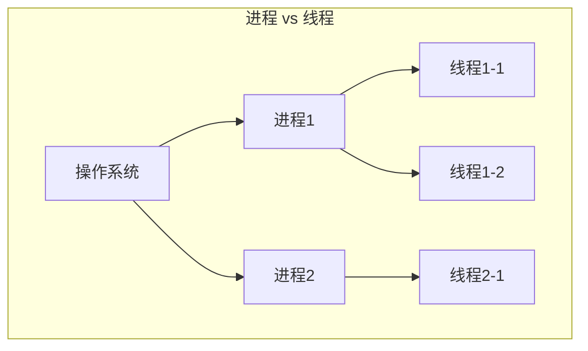
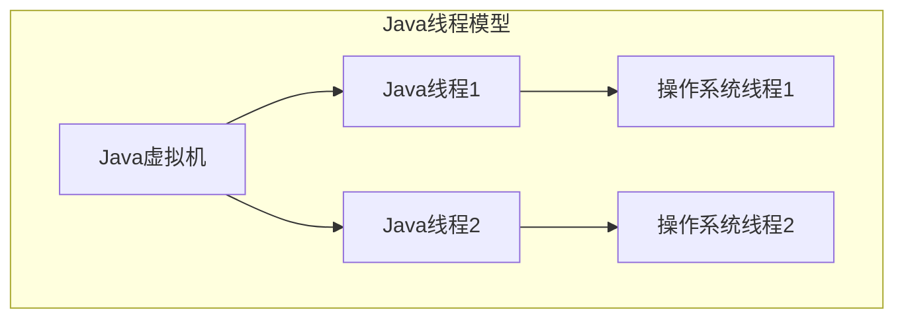
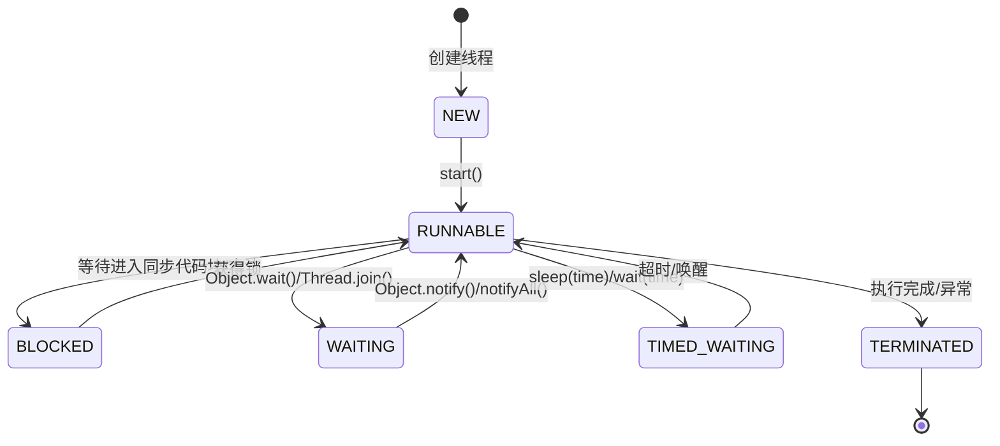

# Java 线程与进程 - 基础篇

## 简介
本文档介绍 Java 中进程与线程的基本概念、Java 线程模型以及线程的基础操作。适合 Java 并发编程的初学者阅读。

## 基本概念

### 进程与线程的区别

进程和线程是操作系统中两个核心概念，它们之间有本质区别：

| 特性 | 进程 | 线程 |
|------|------|------|
| 定义 | 运行中的程序的实例，是系统进行资源分配和调度的基本单位 | 进程中的执行单元，是 CPU 调度的基本单位 |
| 资源占用 | 拥有独立的内存空间、文件描述符等系统资源 | 共享所属进程的内存空间和资源 |
| 通信方式 | 进程间通信（IPC）：管道、消息队列、共享内存、信号量等 | 线程间可直接通过共享变量通信 |
| 切换开销 | 切换开销大，涉及到虚拟内存、页表等切换 | 切换开销小，只需保存和恢复少量寄存器内容 |
| 创建销毁开销 | 创建和销毁开销大 | 创建和销毁开销小 |
| 并发性 | 多进程并发 | 多线程并发 |
| 健壮性 | 一个进程崩溃不会影响其他进程 | 一个线程崩溃会导致整个进程崩溃 |



### Java 线程模型

Java 采用基于操作系统原生线程的一对一线程模型，具有以下特点：

1. **Java 线程与操作系统线程直接映射**：每个 Java 线程对应一个操作系统线程
2. **线程调度依赖操作系统**：线程的调度由操作系统完成，JVM 不负责线程调度
3. **线程优先级映射**：Java 线程的优先级会映射到操作系统线程的优先级，但具体映射关系依赖于操作系统
4. **轻量级进程（LWP）**：在某些系统上，Java 线程实际上是基于轻量级进程实现的



> 注意：与 Go 语言的协程（goroutine）不同，Java 的线程是重量级资源，创建和销毁成本较高。Java 19 引入的虚拟线程是对此问题的解决方案。

## 线程基础

### 线程的创建方式

Java 提供了多种创建线程的方式：

#### 1. 继承 Thread 类

**场景描述**：
当需要创建一个简单的线程，且不需要返回结果时，可以使用继承 Thread 类的方式。

**实现步骤**：
1. 继承 Thread 类
2. 重写 run() 方法
3. 创建线程实例
4. 调用 start() 方法启动线程

**代码实现**：
```java
public class MyThread extends Thread {
    @Override
    public void run() {
        System.out.println("线程运行中...");
    }
    
    public static void main(String[] args) {
        // 创建线程对象
        MyThread thread = new MyThread();
        // 启动线程
        thread.start();
    }
}
```

**关键点说明**：
- 必须调用 start() 方法而不是 run() 方法
- 一个线程实例只能启动一次
- 不建议使用继承 Thread 类的方式，因为 Java 不支持多继承

#### 2. 实现 Runnable 接口

**场景描述**：
当需要创建一个线程，且希望保持类的继承关系时，推荐使用实现 Runnable 接口的方式。

**实现步骤**：
1. 实现 Runnable 接口
2. 实现 run() 方法
3. 创建 Thread 实例，传入 Runnable 对象
4. 调用 start() 方法启动线程

**代码实现**：
```java
public class MyRunnable implements Runnable {
    @Override
    public void run() {
        System.out.println("线程运行中...");
    }
    
    public static void main(String[] args) {
        // 创建 Runnable 实现类对象
        MyRunnable myRunnable = new MyRunnable();
        // 创建线程对象，传入 Runnable 实例
        Thread thread = new Thread(myRunnable);
        // 启动线程
        thread.start();
        
        // 使用 Lambda 表达式简化
        Thread thread2 = new Thread(() -> {
            System.out.println("Lambda 表达式创建的线程");
        });
        thread2.start();
    }
}
```

**关键点说明**：
- 推荐使用实现 Runnable 接口的方式
- 可以使用 Lambda 表达式简化代码
- 更好的面向对象设计，符合组合优于继承的原则

#### 3. 实现 Callable 接口

**场景描述**：
当需要线程执行完成后返回结果时，可以使用实现 Callable 接口的方式。

**实现步骤**：
1. 实现 Callable 接口
2. 实现 call() 方法
3. 创建 FutureTask 包装 Callable 对象
4. 创建 Thread 实例，传入 FutureTask
5. 调用 start() 方法启动线程
6. 使用 FutureTask.get() 获取结果

**代码实现**：
```java
import java.util.concurrent.Callable;
import java.util.concurrent.FutureTask;

public class MyCallable implements Callable<Integer> {
    @Override
    public Integer call() throws Exception {
        // 执行耗时操作
        Thread.sleep(1000);
        return 123; // 返回计算结果
    }
    
    public static void main(String[] args) throws Exception {
        // 创建 Callable 实现类对象
        MyCallable myCallable = new MyCallable();
        // 创建 FutureTask 包装 Callable 对象
        FutureTask<Integer> futureTask = new FutureTask<>(myCallable);
        // 创建线程对象
        Thread thread = new Thread(futureTask);
        // 启动线程
        thread.start();
        
        // 获取线程执行结果（会阻塞等待线程完成）
        Integer result = futureTask.get();
        System.out.println("线程执行结果: " + result);
    }
}
```

**关键点说明**：
- 可以获取线程执行的结果
- 可以抛出异常
- 支持泛型，可以返回任意类型的结果
- get() 方法会阻塞等待线程执行完成

### 线程的生命周期

Java 线程在运行过程中可能处于以下状态：

| 状态 | 说明 |
|------|------|
| NEW | 线程已创建但尚未启动 |
| RUNNABLE | 线程正在 JVM 中运行，但可能在等待操作系统资源（如 CPU 时间片） |
| BLOCKED | 线程被阻塞，等待获取监视器锁 |
| WAITING | 线程进入无限期等待状态，等待被其他线程显式唤醒 |
| TIMED_WAITING | 线程进入计时等待状态，等待超时或被唤醒 |
| TERMINATED | 线程已执行完成或因异常而终止 |



**示例：获取线程状态**
```java
Thread thread = new Thread(() -> {
    // 线程任务
});
System.out.println("初始状态: " + thread.getState()); // NEW
thread.start();
System.out.println("启动后状态: " + thread.getState()); // RUNNABLE
```

## 最佳实践

1. **优先使用实现 Runnable 接口的方式创建线程**
   - 更好的面向对象设计
   - 避免单继承的限制
   - 便于共享代码

2. **使用线程池管理线程**
   - 避免频繁创建和销毁线程
   - 控制并发线程数量
   - 提供线程生命周期管理

3. **正确处理线程异常**
   - 使用 try-catch 捕获异常
   - 实现 UncaughtExceptionHandler 处理未捕获的异常
   - 记录异常日志

4. **合理设置线程优先级**
   - 不要过度依赖线程优先级
   - 优先级设置要合理，避免饥饿问题
   - 考虑使用其他同步机制

## 常见问题

1. **Q: 为什么不能直接调用 run() 方法？**
   A: 直接调用 run() 方法不会创建新线程，而是在当前线程中执行。必须调用 start() 方法才能创建新线程。

2. **Q: 一个线程可以启动多次吗？**
   A: 不可以。一个线程实例只能启动一次，重复启动会抛出 IllegalThreadStateException 异常。

3. **Q: 如何优雅地停止线程？**
   A: 推荐使用标志位或中断机制，而不是直接调用 stop() 方法（已废弃）。

## 参考资料
1. 《Java 并发编程实战》
2. [Oracle 官方文档 - Threads](https://docs.oracle.com/javase/tutorial/essential/concurrency/threads.html)
3. [Java 并发编程网](http://ifeve.com/) 