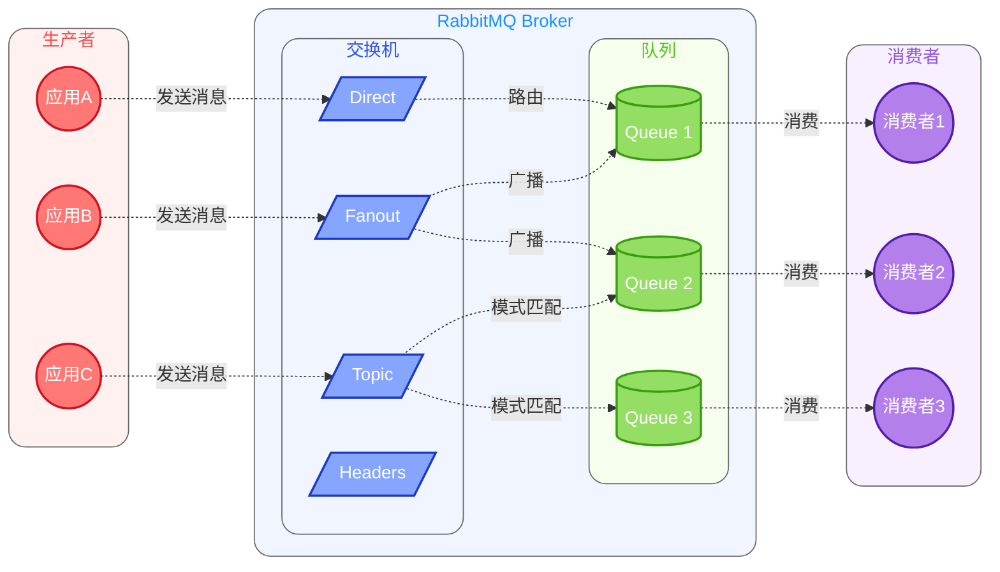

# RabbitMQ 基础概念

## 什么是消息队列？

消息队列（Message Queue）是一种异步通信的中间件技术，用于在分布式系统中传递消息。

## AMQP 协议

AMQP（Advanced Message Queuing Protocol）是一个提供统一消息服务的应用层标准协议。

## RabbitMQ 的架构

RabbitMQ 的核心架构如下图所示：

## RabbitMQ 核心概念

### 1. Producer（生产者）

生产者是发送消息的应用程序。在图中，我们展示了三个生产者应用（A、B、C），它们分别向不同类型的交换机发送消息。

### 2. Consumer（消费者）

消费者是接收消息的应用程序。图中的三个消费者分别从不同的队列中获取消息。

### 3. Exchange（交换机）

交换机负责接收生产者发送的消息，并根据路由规则将消息路由到一个或多个队列。图中展示了四种类型的交换机：
- Direct：根据精确的路由键匹配
- Fanout：广播到所有绑定的队列
- Topic：根据模式匹配的路由键分发
- Headers：根据消息属性进行匹配

### 4. Queue（队列）

队列是消息的存储载体，消息最终将会被投递到队列中，等待消费者取走。图中展示了三个队列，它们与不同的交换机建立了绑定关系。

### 5. Binding（绑定）

绑定是交换机和队列之间的关联关系。图中通过不同类型的连接线展示了绑定关系：
- Direct 交换机通过路由键与队列绑定
- Fanout 交换机广播消息到所有绑定的队列
- Topic 交换机通过模式匹配将消息路由到相应队列

### 6. Routing Key（路由键）

路由键是消息的路由规则，用于指定消息的路由到哪个队列。不同类型的交换机使用路由键的方式也不同。

### 7. Channel（信道）

Channel 是建立在 Connection 上的虚拟连接，是进行消息读写的通道。它可以复用 TCP 连接，提高网络利用率。

### 8. Virtual Host（虚拟主机）

Virtual Host 提供了逻辑隔离，最简单可以理解为命名空间。它允许在一个 RabbitMQ 服务器上创建多个隔离的消息服务环境。
